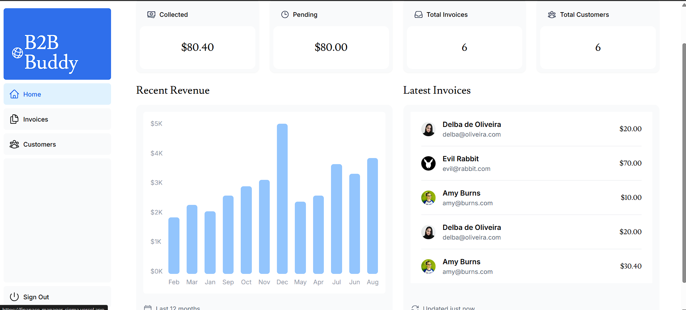
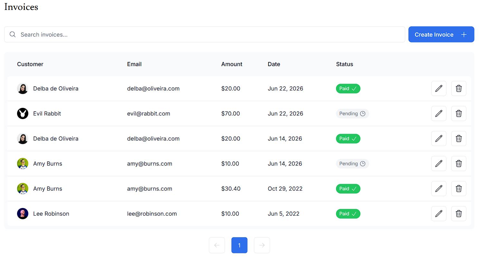
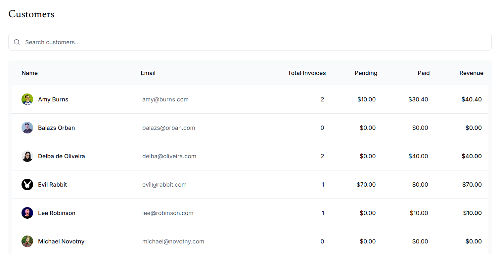

# 💰 Finance Manager

A modern full-stack financial dashboard built with **Next.js**, **TypeScript**, **PostgreSQL**, and **Tailwind CSS**. Finance Manager helps businesses manage invoices, track customers, monitor revenue, and gain insights through an intuitive and responsive interface.

🔗 **Live Demo:** https://finanace-manager-sigma.vercel.app/

---

## 🚀 Features

### 📊 Dashboard Analytics
- Revenue overview and key business metrics
- Recent invoices and transactions
- Customer statistics
- Financial performance insights

### 🧾 Invoice Management
- Create, edit, and delete invoices
- Search and filter invoices
- Track invoice status and payments
- Server-side form validation

### 👥 Customer Management
- Manage customer records
- View customer invoice history
- Organize business data efficiently

### 🔐 Authentication & Security
- Secure user authentication
- Protected dashboard routes
- Session-based access control

### 📱 Responsive Design
- Mobile-friendly interface
- Fast navigation and optimized performance
- Clean and modern dashboard UI

---

## 🛠️ Tech Stack

- **Frontend:** Next.js, React, TypeScript
- **Styling:** Tailwind CSS
- **Database:** PostgreSQL
- **Authentication:** NextAuth/Auth.js
- **Deployment:** Vercel
- **Backend:** Next.js Server Actions

---

## 📂 Project Structure

```text
finance-manager/
├── app/
│   ├── dashboard/
│   ├── invoices/
│   ├── customers/
│   └── login/
├── components/
├── ui/
├── lib/
├── public/
└── README.md
```

---

## ⚡ Getting Started

### Clone the Repository

```bash
git clone https://github.com/your-username/finance-manager.git
cd finance-manager
```

### Install Dependencies

```bash
npm install
```

### Configure Environment Variables

Create a `.env.local` file:

```env
POSTGRES_URL=xxxx
POSTGRES_PRISMA_URL=xxxx
POSTGRES_URL_NON_POOLING=xxxx

AUTH_SECRET=xxxx
AUTH_URL=xxxx
```

### Run the Development Server

```bash
npm run dev
```

Open http://localhost:3000 in your browser.

---

## 🎯 What I Learned

- Building full-stack applications with Next.js
- Implementing authentication and protected routes
- Database integration with PostgreSQL
- Server-side rendering and data fetching
- CRUD operations and form validation
- Deploying production-ready applications on Vercel
- Creating responsive user interfaces with Tailwind CSS

---

## 🔮 Future Enhancements

- PDF invoice generation
- Revenue analytics charts
- Role-based access control
- Email notifications
- Financial report exports
- Dark mode support
- Multi-user collaboration

---

## 📸 Screenshots

### Dashboard


### Invoices


### Customers


---

## 💡 Motivation

Many small businesses still rely on spreadsheets to manage invoices and financial records. Finance Manager was built to explore how these workflows can be streamlined into a centralized web application with secure authentication, efficient data management, and actionable business insights.


⭐ If you found this project interesting, feel free to star the repository!